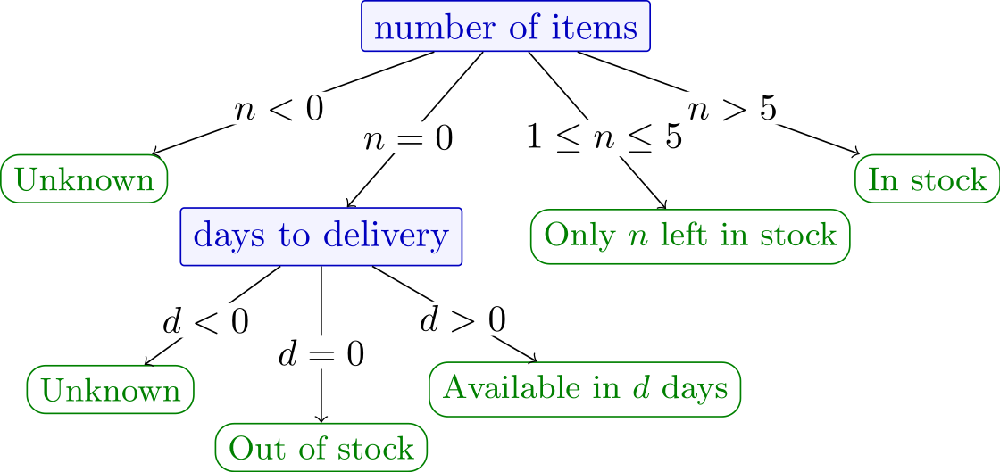

<a id="midterm2023fall"></a>

# Midterm Fall 2023

| **Course name:**     | Computer programming                                                          |
|----------------------|-------------------------------------------------------------------------------|
| **Course number:**   | 02002 and 02003                                                               |
| **Exam date:**       | Midterm test exam, October 2023                                               |
| **Aids allowed:**    | All aids, no internet                                                         |
| **Exam duration:**   | 2 hours for the midterm test exam (4 hours for the real exam 6th of December) |
| **Weighting:**       | All tasks have equal weight                                                   |
| **Number of tasks:** | 5                                                                             |

## Exam Instructions

### Prerequisites

To be able to solve the exam tasks, you need to have a computer with Python, VSCode, course toolbox, and software packages installed.

### Exam Material

The exam material consists of:

- The midterm text as a PDF document `midterm2023fall_English.pdf` (this document) and the same document but in Danish `midterm2023fall_Danish.pdf`.
- The download script `download_midterm2023fall.py`.

You should save the download script, open it in VSCode, and run it. The script will create the files and folders that you need to solve the exam tasks, similar to how weekly exercises and projects were created. The download script will create the following folders and files:

- A tasks folder `02002students/cp/midterm2023fall/tasks/` containing one Python file for each task, serving as a template for the code you need to write.
- A project folder `02002students/cp/midterm2023fall/project/` containing one Python file for testing and one Python file for grading your solutions.

If the download script encounters a problem and cannot find the `02002students` folder, it will create the files and folders in the location of the download script.

### Solving Exam Tasks

When solving exam tasks, follow the instructions from the exam text and complete the provided Python files from the tasks folder. You can test your solutions by running the provided testing script `midterm2023fall_tests.py`, which tests your solution on a small number of test cases. Solving the tasks and using the testing script is similar to how you have solved weekly exercises and projects. However, for the exam, additional test cases will be used during the evaluation after the exam.

If you believe there is a mistake or ambiguity in the text, you should use the most reasonable interpretation of the text to solve the task to the best of your ability. If we, after the exam, find inconsistencies in one or more tasks, this will be taken into account in the assessment.

### Handing in the Solution

To hand-in your solution, generate a token file by running the provided grading script `midterm2023fall_grade.py`. Upload the token file to the [digital exam system](https://eksamen.dtu.dk/) as the main document. Additionally, as an extra assurance, submit your Python solutions. That is, submit the completed Python files from the task folder as attachments in the digital exam system. We will use the Python files if we encounter problems with the token file.

You should thus submit the following file as the main document:

- `Midterm2023Fall_handin_xx_of_100.token` (where `xx` is your current score)

and the following files as attachments:

- `compound_interest.py`
- `dice_fairness.py`
- `first_alarm.py`
- `stock_status.py`
- `typical_successor.py`

## Task 1: Compound Interest

Compound interest is a term from banking. The formula for compound interest $I$ after one year is

$$
I = P\left(1 + \frac{r}{n}\right)^n - P.
$$

Here, $P$ is the principal sum, $r$ is the interest rate (in decimals e.g., 4% is given as $r=0.04$), and $n$ is the compounding frequency.

You should write a function that takes as input three numbers: `principal` for the principal sum,  `rate` for the interest rate, and `frequency` for the compounding frequency. The function should return the compound interest.

As an example, consider the input:

```pycon
>>> compound_interest(1500, 0.04, 8)
61.06056588815591
```

With a principal of 1500 (in units of a certain currency, e.g., DKK), an interest rate of 0.04 (equivalent to 4%), and a compounding frequency of 8 (that is, compounding occurs 8 times a year), the compound interest is

$$
I = 1500\left(1 + {\frac{0.04}{8}}\right)^{8} - 1500,
$$

which is approximately 61.06, and this is what your function should return.

To be able to hand in your solution insert it into the file:
`cp/midterm2023fall/tasks/compound_interest.py`.

The specifications are:

### cp.midterm2023fall.tasks.compound_interest.compound_interest(principal, rate, frequency)

Return the compound interest given principal, rate and frequency.

* **Parameters:**
  * **principal** (`int`) – A positive integer, the principal sum.
  * **rate** (`float`) – A positive float, the interest rate.
  * **frequency** (`int`) – A positive integer, the compounding frequency.
* **Return type:**
  `float`
* **Returns:**
  The compound interest.


### Solution

A file with the following content would be a correct solution for the task:

```python
"""Task 1: Compound interest."""

def compound_interest(principal:int, rate:float, frequency:int) -> float:
    """Return the compound interest given principal, rate and frequency.

    :param principal: A positive integer, the principal sum.
    :param rate: A positive float, the interest rate.
    :param frequency: A positive integer, the compounding frequency.
    :return: The compound interest.
    """
    I = principal * (1 + rate / frequency) ** frequency - principal
    return I

```

## Task 2: Stock Status

When customers visit a webshop page for a certain product, they see information about the stock status. This information is based on two numbers: `number_of_items`, the number of items currently in stock; and `days_to_delivery`, the number of days until delivery of new items from the factory, where 0 indicates that new items are not expected.

| **Displayed text**       | **Stock situation**                                                                                                 |
|--------------------------|---------------------------------------------------------------------------------------------------------------------|
| `In stock`               | 6 or more items in stock                                                                                            |
| `Only <n> left in stock` | Between 1 and 5 items in stock. Here `<n>` is the number of items in stock.                                         |
| `Available in <d> days`  | No items in stock, but new items are expected. Here `<d>` is the number of days to delivery.                        |
| `Out of stock`           | No items in stock, and no new items are expected.                                                                   |
| `Unknown`                | Either number of items is negative, or there are no items in stock, and the number of days to delivery is negative. |

Another way of representing the stock status is with a decision tree:



Your task is to write a function that takes as input `number_of_items` and `days_to_delivery`. The function should return the string with the text to be displayed.

As an example consider the input:

```pycon
>>> stock_status(4, 7)
'Only 4 left in stock'
```

In this case, `number_of_items` is between 1 and 5, so the function should return the string `"Only 4 left in stock"`.

To be able to hand in your solution insert it into the file:
`cp/midterm2023fall/tasks/stock_status.py`.

The specifications are:

### cp.midterm2023fall.tasks.stock_status.stock_status(number_of_items, days_to_delivery)

Return stock status message given number of items and days to delivery.

* **Parameters:**
  * **number_of_items** (`int`) – An integer, the number of items in stock.
  * **days_to_delivery** (`int`) – An integer, the number of days to delivery.
* **Return type:**
  `str`
* **Returns:**
  The stock status message.

### Solution

A file with the following content would be a correct solution for the task:

```python
"""Task 2: Stock status."""

def stock_status(number_of_items:int, days_to_delivery:int) -> str:
    """Return stock status message given number of items and days to delivery.

    :param number_of_items: An integer, the number of items in stock.
    :param days_to_delivery: An integer, the number of days to delivery.
    :return: The stock status message.
    """
    if number_of_items<0:
        return('Unknown')
    elif number_of_items>5:
        return('In stock')
    elif number_of_items>0:
        return('Only ' + str(number_of_items) + ' left in stock')
    else:
        if days_to_delivery<0:
            return('Unknown')
        elif days_to_delivery>0:
            return('Available in ' + str(days_to_delivery) + ' days')
        else:
            return('Out of stock')

```

## Task 3: First Alarm

The water level of a river is measured (in meters) and recorded every hour. An alarm is triggered if any of the following two conditions are met:

1. The water level has risen by more than 0.2 meters during the last hour, and the resulting water level is higher than 1.5 meters.
2. The water level is above 2.0 meters.

The water level measurements are stored in a list called `water_levels`. Your task is to write a function that returns the index of the first alarm. If no alarm is triggered, the function should return -1. All inequalities are strict ($<$ is strict whereas $\leq$ is not); for example, a water level of exactly 2.0 meters is not enough to trigger an alarm.

As an example, consider the input:

```pycon
>>> first_alarm([1.52, 1.29, 1.32, 1.18, 1.45, 1.63, 1.81, 1.95, 2.11, 2.09, 1.98, 1.3])
8
```

The increase in water level between two consecutive hours is strictly greater than 0.2 meters only between measurements at index 3 and 4. However, the resulting water level at index 4 is not strictly above 1.5 meters, so no alarm is triggered there. An alarm is triggered at index 8 because the water level is strictly above 2.0 meters. Thus, the function returns 8.

To be able to hand in your solution insert it into the file:
`cp/midterm2023fall/tasks/first_alarm.py`.

The specifications are:

### cp.midterm2023fall.tasks.first_alarm.first_alarm(water_levels)

Return the index of the first alarm given the list of water levels.

* **Parameters:**
  **water_levels** (`list`) – A list of floats, the water levels.
* **Return type:**
  `int`
* **Returns:**
  The index of the first alarm.


### Solution

A file with the following content would be a correct solution for the task:

```python
"""Task 3: First alarm."""

def first_alarm(water_levels:list) -> int:
    """Return the index of the first alarm given the list of water levels.

    :param water_levels: A list of floats, the water levels.
    :return: The index of the first alarm.
    """
    for i in range(1, len(water_levels)):
        if water_levels[i] > 2.0:
            return i
        elif water_levels[i] > 1.5 and (water_levels[i] - 
                                        water_levels[i -1] > 0.2):
            return i
    return -1

```

## Task 4: Typical Successor

In various languages, some combinations of letters are more common than others. For example, in the English language, the letter `q` is almost always followed by the letter `u`.

In this task, you should write a function that takes as input two strings: `text`, a string representing some text; and `letter`, a string containing one lower case letter from the English alphabet. The function should return the letter that most frequently follows the given letter in the text. If the given letter is not found in the text or is not followed by any other letter, the function should return an empty string.

The following rules apply:

- The input text may contain both upper and lower case letters, but you should treat them all as lower case letters. For example, `A` and `a` should be treated as `a`.
- All characters that are not letters of the English alphabet should be ignored. However, they should be treated as breaks in the flow of succession. For example, in `up-down`, the letter `p` is *not* followed by the letter `d`.
- In general, two or more letters may be the most frequent successors. In our tests, there is always *exactly one* most frequent successor. Therefore, you can assume that if the letter is found in the text and has successors, there is exactly one which is the most frequent.

As an example, consider following input:

```pycon
>>> text = 'Hello world. This usual salutation usually starts programming.'
>>> typical_successor(text, 'l')
'l'
```

In this text string, the letter `l` appears 7 times. It is 6 times followed by another letter, and once by space. The letter `l` is followed by `d` once, by `l` twice, by `o` once, by `u` once, and by `y` once. Therefore `l` should be returned.

To be able to hand in your solution insert it into the file:
`cp/midterm2023fall/tasks/typical_successor.py`.

The specifications are:

### cp.midterm2023fall.tasks.typical_successor.typical_successor(text, letter)

Return the letter that most often follows the given letter in the text.

* **Parameters:**
  * **text** (`str`) – A string, the text.
  * **letter** (`str`) – A string, the letter.
* **Return type:**
  `str`
* **Returns:**
  The letter that most often follows the given letter.


### Solution

A file with the following content would be a correct solution for the task:

```python
"""Task 4: Typical successor."""

def typical_successor(text:str, letter:str) -> str:
    """Return the letter that most often follows the given letter in the text.
    
    :param text: A string, the text.
    :param letter: A string, the letter.
    :return: The letter that most often follows the given letter.
    """
    alphabet = 'abcdefghijklmnopqrstuvwxyz'
    my_dict = {}
    for i in alphabet:
        my_dict[i] = 0
    for i in range(len(text) - 1):
        if text[i].lower() == letter:
            if text[i + 1].lower() in alphabet:
                my_dict[text[i + 1].lower()] += 1
    max = 0
    for i in alphabet:
        if my_dict[i] > max:
            max = my_dict[i]
            letter = i

    if max > 0:
        return letter
    else:
        return ''

```

## Task 5: Dice Fairness

You want to check if a set of dice throws is fair by answering three questions: Which number appears the most? How many times does it appear? What’s the expected number of times for each number to be thrown?

Your task is to write a function that takes as input a list of numbers from 1 to 6 and returns a 3-element tuple containing:

- The number that appears most frequently among the throws.
- The number of times this most frequent number appears.
- The expected number of times for a number to be thrown, calculated by dividing the number of throws by 6.

You can assume that the input list is not empty and contains only numbers from 1 to 6. If there is a tie for the most frequent number, the function should return the smaller number.

As an example, consider the following list of throws:

```pycon
>>> throws = [4, 2, 4, 4, 5, 6, 1, 2, 3, 4, 2, 3, 5, 5, 4, 4, 3, 2, 1, 4, 6]
>>> dice_fairness(throws)
(4, 7, 3.5)
```

The most frequent number is 4, which occurs 7 times. There are 21 throws, so the expected number of times for a number to be thrown is 21 divided by 6, which is 3.5. The function should, therefore, return the tuple `(4, 7, 3.5)`.

To be able to hand in your solution insert it into the file:
`cp/midterm2023fall/tasks/dice_fairness.py`.

The specifications are:

### cp.midterm2023fall.tasks.dice_fairness.dice_fairness(throws)

Return the 3-element tuple containing dice statistics.

* **Parameters:**
  **throws** (`list`) – A list of integers, the throws of a dice.
* **Return type:**
  `tuple`
* **Returns:**
  A 3-element tuple containing information about the throws.


### Solution

A file with the following content would be a correct solution for the task:

```python
"""Task 5: Dice fairness."""

def dice_fairness(throws:list) -> tuple:
    """Return the 3-element tuple containing dice statistics.

    :param throws: A list of integers, the throws of a dice.
    :return: A 3-element tuple containing information about the throws. 
    """
    counts = [0] * 6
    for r in throws:
        counts[r - 1] += 1
    
    max_count = max(counts)
    most_frequent = counts.index(max_count) + 1
    expected = len(throws) / 6

    return most_frequent, max_count, expected

```
